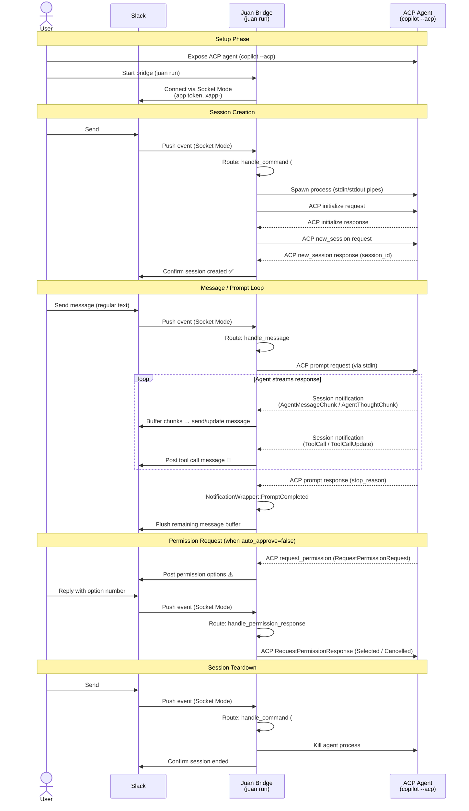

# Juan - Slack as ACP Client

[](https://github.com/DiscreteTom/juan/releases)
[](https://github.com/DiscreteTom/juan/blob/main/LICENSE)

A self-hosted bridge that allows you to interact with ACP-compatible coding agents through Slack, so you can code from anywhere. Run it on your PC to connect your Slack workspace with local or remote AI coding agents.

[📺 Watch Demo Video](https://youtube.com/shorts/_ewlQOAx1Zg?feature=share)

## Installation

<details open>
<summary>Linux/macOS</summary>

```sh
curl --proto '=https' --tlsv1.2 -LsSf https://github.com/DiscreteTom/juan/releases/latest/download/juan-installer.sh | sh
```

</details>

<details>
<summary>Windows</summary>

```sh
powershell -ExecutionPolicy Bypass -c "irm https://github.com/DiscreteTom/juan/releases/latest/download/juan-installer.ps1 | iex"
```

</details>

<details>
<summary>From Source</summary>

```sh
cargo install --git https://github.com/DiscreteTom/juan
```

</details>

## Slack App Setup

1. Go to [https://api.slack.com/apps](https://api.slack.com/apps) and create a new app
2. Enable Socket Mode:
   - Go to "Socket Mode" in the sidebar
   - Enable Socket Mode
   - Generate an app-level token with `connections:write` scope (starts with `xapp-`)
3. Add Bot Token Scopes:
   - Go to "OAuth & Permissions"
   - Add these scopes:
     - `app_mentions:read` - Read messages that mention your app
     - `chat:write` - Send messages
     - `channels:history` - View messages in public channels
     - `groups:history` - View messages in private channels
     - `im:history` - View messages in direct messages
     - `files:read` - View files in messages and channels
     - `files:write` - Upload files and share them
     - `reactions:write` - Add emoji reactions to messages
   - Install the app to your workspace
   - Copy the Bot User OAuth Token (starts with `xoxb-`)
4. Enable Events:
   - Go to "Event Subscriptions"
   - Subscribe to bot events:
     - `app_mention` - When your app is mentioned
     - `message.channels` - Messages in channels
     - `message.groups` - Messages in private channels
     - `message.im` - Direct messages
5. Configure App Home:
   - Go to "App Home"
   - Under "Show Tabs", check "Allow users to send Slash commands and messages from the messages tab"

## Getting Started

Create a config file (juan.toml):

```bash
juan init
```

Edit config file to set your Slack tokens:

- Set bot_token (starts with `xoxb-`)
- Set app_token (starts with `xapp-`)

Run the bridge:

```bash
juan run
```

> [!TIP]
> It's recommended to run Juan in tmux so it persists in the background:
>
> ```bash
> tmux new -s juan "juan run"
> ```

In your Slack, talk to the Slack APP. Use `#help` to see help.

## How Slack ACP Communication Works

The following diagram shows the full message flow starting from a user exposing an ACP-compatible agent (e.g. `copilot --acp`) through to responses appearing in Slack.



## [CHANGELOG](./CHANGELOG.md)
